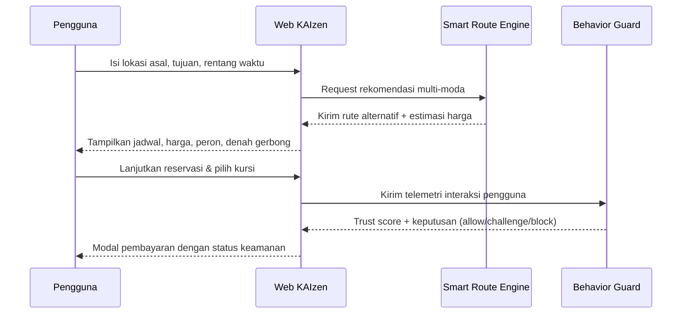

# KAIzen: Smart Route Finder & Behavior Guard Toolkit

KAIzen adalah inisiatif modernisasi website KAI yang menghadirkan dua inovasi utama sekaligus:

1.  **Mesin pencarian rute cerdas** yang mampu merekomendasikan perjalanan multi-moda berdasarkan lokasi pengguna, tujuan, dan rentang waktu keberangkatan.
2.  **Teknologi deteksi bot berbasis perilaku (Behavior Guard)** untuk menangkal calo yang menggunakan otomatisasi ketika memesan tiket.

Folder `nodejs/` berisi skrip pendukung yang membantu tim menguji, mengumpulkan data, dan menganalisis efektivitas fitur-fitur tersebut. Dokumen ini merangkum masalah yang kami pecahkan, fitur unggulan, serta panduan menjalankan komponen utama proyek.

## Masalah yang Dipecahkan

- **Rute tidak tersedia di stasiun terdekat pada rentang waktu yang diinginkan**
  - Dampak: pengguna terpaksa merencanakan perjalanan secara manual dan memakan waktu.
  - Solusi KAIzen: mesin rekomendasi multi-moda otomatis menyusun kombinasi kereta antarkota, Commuter Line, dan perpindahan antar stasiun.

- **Informasi rute masih minim** (tidak ada nomor peron, denah gerbong, estimasi biaya)
  - Dampak: pengguna sulit menyiapkan perjalanan secara rinci.
  - Solusi KAIzen: hasil rekomendasi menyertakan jadwal lengkap, estimasi harga, nomor peron, dan denah gerbong.

- **Calo/bot memborong tiket saat rilis**
  - Dampak: tiket cepat habis, harga melonjak di pasar gelap, citra perusahaan turun.
  - Solusi KAIzen: Behavior Guard memantau input pengguna, memberikan trust score, dan memblokir perilaku mencurigakan.

## Fitur Unggulan

1.  **Smart Route Finder**
    - Input: lokasi asal, tujuan, rentang waktu (misal 21.00–23.00).
    - Output: rekomendasi rute multi-moda dengan estimasi harga, waktu tempuh, nomor peron, dan denah gerbong.
    - Contoh: pengguna dari *President University* ingin ke *Stasiun Tawang Semarang* antara 22.00–23.59. Sistem mendeteksi tidak ada kereta malam dari *Stasiun Cikarang*, lalu menawarkan rute Cikarang ➝ (Commuter Line) ➝ Bekasi ➝ (Kereta antarkota) ➝ Semarang.

2.  **Behavior Guard Trust Scoring**
    - Mengumpulkan sinyal perilaku (gerakan mouse, kecepatan mengetik, pola klik) untuk membedakan manusia dan bot.
    - Memberi **trust score** pada tahap pembayaran; sesi berisiko tinggi dapat diblokir atau diberi verifikasi tambahan.

3.  **Automation & Analytics Toolkit (`nodejs/`)**
    - `bot-detection-test.js`: Menjalankan simulasi bot end-to-end hingga modal pembayaran untuk memverifikasi skor kepercayaan.
    - `collect-training-data*.js`: Mengumpulkan data perilaku bot/manusia sebagai dataset pelatihan.
    - `train-model.js`: Melatih model TensorFlow.js sederhana untuk klasifikasi perilaku.

## Alur Pengalaman Pengguna



## Struktur direktori terkait

```
KAI_Smart_Route/
├─ app/, routes/            # logika Laravel: pencarian, reservasi, pembayaran
├─ resources/views/         # Blade templates (home, routes, reservasi, pembayaran)
├─ public/js/               # Frontend interaksi (autocomplete, rekomendasi rute, guard)
├─ nodejs/                  # <== skrip otomasi dan ML
│   ├─ bot-detection-test.js
│   ├─ collect-training-data.js
│   ├─ collect-training-data-human.js
│   ├─ train-model.js
│   └─ ...
└─ README.md                # ringkasan proyek tingkat atas
```

## Cara Menjalankan

### 1. Aplikasi Laravel (Smart Route + Behavior Guard Frontend)

```bash
# dari akar repositori
composer install
cp .env.example .env
# sesuaikan konfigurasi database
php artisan key:generate
php artisan migrate --seed
npm install
npm run dev
php artisan serve
```

### 2. Behavior Guard Backend & Toolkit Node.js

```bash
cd nodejs
npm install
node server/server.js        # endpoint behavior guard
# terminal kedua
node bot-detection-test.js   # simulasi bot end-to-end
```

Skrip simulasi akan menghasilkan **Trust Score** di terminal dan menyimpan screenshot `bot-detection-result.png`.

## Data  Machine Learning Workflow

1. Jalankan bot/penugasan manusia → data gerakan mouse & keyboard terekam.
2. Dataset tersimpan (`training-data-bot.json`, `training-data-human.json`).
3. `train-model.js` menormalisasi fitur (kecepatan, jitter, ritme ketikan).
4. Model TensorFlow.js dihasilkan (`model.json`) beserta statistik normalisasi (`normalization-stats.json`).
5. Model dapat di-*load* di sisi server maupun frontend untuk scoring real-time.

## Roadmap Singkat

- Integrasi API jadwal real-time dan harga dinamis.
- Algoritma optimasi multi-leg (RAPTOR/A* berbobot).
- PWA mode untuk akses offline dan notifikasi keberangkatan.
- Dynamic challenge yang hanya aktif untuk sesi borderline.
- Dashboard monitoring untuk tim operasional (heatmap serangan, trust score historis).

## Kontribusi

- Buka issue / pull request untuk ide perbaikan.
- Sertakan deskripsi jelas, langkah reproduksi, dan bukti pengujian.
- Pastikan ESLint/Prettier (jika tersedia) dan test relevan dijalankan sebelum commit.